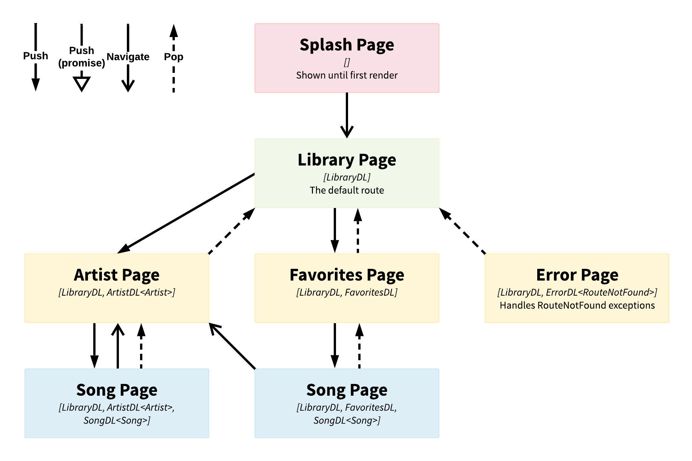
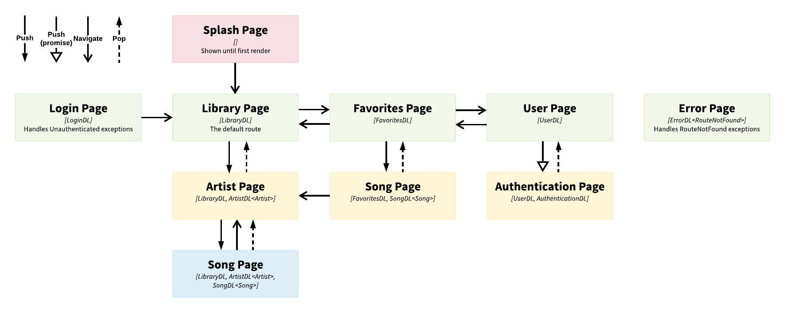

# Flutter Deep Link Navigation

[](https://pub.dev/packages/deep_link_navigation)
[](https://github.com/Dennis-Krasnov/Flutter-Deep-Link-Navigation)
[](https://github.com/Dennis-Krasnov/Flutter-Deep-Link-Navigation/blob/master/LICENSE)
[](https://github.com/Solido/awesome-flutter#navigation)

<!-- [](https://codecov.io/gh/Dennis-Krasnov/Diet-Driven) -->
<!-- [](https://codemagic.io/apps/5d8d561b6fd630197006310b/5d8d561b6fd630197006310a/latest_build) -->


Provides an elegant abstraction for complete deep linking navigation in Flutter.

This package **only provides deep linking for internal navigation**. Any external platform-level deep linking solution can optionally be used in conjuction with this package.

The target audience of the documentation is experienced Flutter developers.

## Motivation
There's nothing wrong with not using deep links for internal navigation.

Partially implementing deep links would either have **limited benefits** or be **extremely complicated** (not to mention confusing).

Hence why if you decide to use deep links, it makes sense to exclusively use deep links.

**If you try to implement complete deep linking yourself here's some of the issues you'll run into:**
* Widgets become coupled with their place in the navigation hierarchy
    - Becomes an issue if you want to reuse a page
    - No amount of fancy iteration or recursion will help
* It's difficult to 'pass down' deep link values used in higher levels
    - Given the hierarchy is `Artist` --> `Song`
    - Being able to do `(artist) => ArtistPage(artist)` and later `(song) => SongPage(artist, song)`
    - I actually published a [rest-like router package](https://pub.dev/packages/rest_router) while trying to solve this issue
* How do you represent deep links internally?
    - How to keep configuration as terse as possible?
    - How to represent current route in a string-friendly format (eg. for analytics, debugging)
    - How to serialize route to be used with a platform-level deep linking solution
    - How to handle native navigator pops (eg. back button)?
    - How to handle a route that doesn't exist (or any other exception that occurs during dispatch)?
* How do you integrate custom logic for validating deep link navigation?
    - Ideally provide context to be able to access state management
    - eg. certain subtrees of the navigation hierarchy are available only for subscribed or authenticated users

**TL;DR**

I separated the navigation system from [Diet Driven](https://github.com/Dennis-Krasnov/Diet-Driven) (shameless plug, [please hire me](https://denniskrasnov.com/)) into its own package and published it.

This package provides a solution for all the aforementioned difficulties.

## Examples
### [Single base route](https://github.com/Dennis-Krasnov/Flutter-Deep-Link-Navigation/tree/master/examples/single_base_route)
**This example demonstrates:**
* Dispatchers with path-only deep links
* Dispatchers with value deep links (ArtistDL, SongDL)
* Exception handling (RouteNotFoundDL)
* Cross-branch navigation (from favorite's song page to artist page)


### [Multiple base routes](https://github.com/Dennis-Krasnov/Flutter-Deep-Link-Navigation/tree/master/examples/multiple_base_routes)
**This example demonstrates:**
* Everything from single base route example
* Bottom navigation (library, favorites, user pages) persists across navigation
* Login and error pages are full screen (hide bottom navigation)
* Using the asynchronous result of push (AuthenticationDL from UserDL)
* Custom `Authenticated` mixin ensures user is authenticated (LibraryDL, FavoritesDL, UserDL)


## Configuration
#### Deep links
`DeepLink` is base unit of routes, a deep link is mapped to a `Widget` by a `Dispatcher`.

Deep links may be reused in different levels of the navigation hierarchy.

A route is the full location of a page, represented by `List<DeepLink>`.

`path` is the string representation of the route aka `route.join("/")`.

**Path**
```dart
class LibraryDL extends DeepLink {
    LibraryDL() : super("library");
}
```

**Value**

Deep links can also store data, value dispatchers are strongly typed.
```dart
class SongDL extends ValueDeepLink<Song> {
    SongDL(Song song) : super("song", song);
}

class SongDL extends ValueDeepLink<Song> {
    // Override toString
    SongDL(Song song) : super("song", song, toString: (song) => song.id);
}
```

**Mixin for sake of inheritence**

This could also be achieved by implementing an abstract class.

See use in *Child builder* section.
```dart
mixin FullScreen on DeepLink {}

class LoginDL extends DeepLink with FullScreen {
    LoginDL() : super("login");
}
```

**Mixin with logic**
```dart
mixin Authenticated on DeepLink {
    @override
    void onDispatch(BuildContext context) {
        // Get state from context or global/static variable
        final isAuthenticated = Provider.of<AuthenticationService>(context, listen: false).authenticated;

        // Throw custom exception
        if (!isAuthenticated) {
            throw Unauthenticated();
        }
    }
}

// ...

navigation: (context) => Dispatcher()
    // Unauthenticated login page
    ..exception<Unauthenticated>((exception, route) => [LoginDL()])
    ..path<LoginDL>((route) => LoginPage()),
```

#### Application
Use `DeepLinkMaterialApp` instead of using Flutter's `MaterialApp`.

This replaces native navigation options with their deep link counterparts.

At most one deep link of a type can exist on a dispatcher.

**Deep link material app**
```dart
DeepLinkMaterialApp(
    navigation: (context) => Dispatcher() // see next section ...
    defaultRoute: [LibraryDL()], // if ommited, the splash screen is shown until explicit navigation
    splashScreen: SplashPage(),
    childBuilder: // see child builder section ...

    // Non-navigation related fields are still available
    themeMode: ThemeMode.light,
    // ...
);
```

**Path dispatcher**
```dart
..path<LoginDL>((route) => LoginPage()),

..pathRoute<LoginDL>((path) => LoginPage(),
    transition: (widget) => MaterialPageRoute(builder: (_) => widget),
), // with a custom page route or a custom PageRouteBuilder that implement custom route transitions

..path<LoginDL>(
    (route) => LoginPage(),
    transition: (widget) => DeepLinkTransition(
        type: PageTransitionType.fade,
        child: widget,
    ),
 ), // with custom DeepLinkTransition, an implementation of PageRouteBuilder provided by this package

..pathRoute<LoginDL>(
    (route) => LoginPage(),
    transition: DeepLinkTransitions.fade(),
) // with one of the custom transition shorthand builder functions provided by this package
..
```

**Value dispatcher**
```dart
..value<Song, SongDL>((song, route) => SongPage(song: song)),

.valueRoute<Song, SongDL>(
    (song, route) => SongPage(song: song),
    transition: (widget) => MaterialPageRoute(builder: (_) => widget),
), // with a custom page route or a custom PageRouteBuilder that implement custom route transitions

..valueRoute<Artist, ArtistDL>(
    (artist, route) => ArtistPage(artist: artist),
    transition: DeepLinkTransition.scale(
        alignment: Alignment.center,
        duration: Duration(milliseconds: 800),
    ),
) // with one of the custom transition shorthand builder functions provided by this package
```

**Sub navigation**

```dart
..path<LibraryDL>(
    (route) => LibraryPage(),
    subNavigation: Dispatcher() // ...
),

..value<Song, SongDL>(
    (song, route) => SongPage(song: song),
    subNavigation: (song) => Dispatcher() // song may be used from this point onward
),
```

**Exception mapping**

Exceptions that are thrown while running through the navigation hierarchy are mapped to routes.

`..exception<RouteNotFound>` **MUST** be defined on the base-level dispatcher.

If multiple mappings of the same type are found thoughout the hierarchy, the deep-most mapping is used.
```dart
..exception<RouteNotFound>((exception, route) => [ErrorDL<RouteNotFound>(exception)])
```

#### Child builder
The widget specified in `childBuilder` is rebuilt when the route in `deepLinkNavigator` changes.
```dart
/// [DeepLink]s associated with the bottom navigation.
final bottomNavigationDeepLinks = [LibraryDL(), FavoritesDL(), UserDL()];

/// Current index of bottom navigation based on [currentRoute].
int currentIndex(List<DeepLink> currentRoute) {
    final index = bottomNavigationDeepLinks.indexOf(currentRoute?.first);
    return index != -1 ? index : 0;
}

/// ...

childBuilder: (BuildContext context, DeepLinkNavigator deepLinkNavigator, Widget child) => Scaffold(
    body: child,
    // Don't show bottom navigation while [currentRoute] is null, or any deep list is [FullScreen]
    bottomNavigationBar: deepLinkNavigator.currentRoute?.any((dl) => dl is FullScreen) ?? true ? null : BottomNavigationBar(
        currentIndex: currentIndex(deepLinkNavigator.currentRoute),
        onTap: (int index) => deepLinkNavigator.navigateTo([bottomNavigationDeepLinks[index]]),
        items: [
            BottomNavigationBarItem(title: Text("Library"), icon: Icon(Icons.queue_music)),
            BottomNavigationBarItem(title: Text("Favorites"), icon: Icon(Icons.favorite)),
            BottomNavigationBarItem(title: Text("User"), icon: Icon(Icons.person)),
        ],
    ),
)
```

#### In-app navigation
`DeepLinkNavigator` mirrors `Navigator`'s interface as much as possible (including push and pop futures).

All methods internally orchestrate a native flutter navigator.

**Push a deep link**
```dart
await DeepLinkNavigator.of(context).push(ArtistDL(...));

await DeepLinkNavigator.of(context).push(
    ArtistDL(...),
    transition: ....); //with transition 
```

**Pop a value**
```dart
DeepLinkNavigator.of(context).pop(...);

// or

Navigator.of(context).pop(...);
```

**Navigate to specific route**
```dart
DeepLinkNavigator.of(context).navigateTo([
    LibraryDL(),
    ArtistDL(...),
]);

DeepLinkNavigator.of(context).navigateTo([
    LibraryDL(),
    ArtistDL(...),
],
transition: ....); //with transition
```

**Return to default route (if any)**
```dart
DeepLinkNavigator.of(context).replaceWithDefault();

DeepLinkNavigator.of(context).replaceWithDefault(transition: ...); //with transition
```

**TODO: Throw exception to be caught by mapper**
```dart
// TODO DeepLinkNavigator.of(context).throw(Exception(...));
```

**TODO: Access deep link navigator from anywhere**
```dart
// TODO DeepLinkNavigator()...
```

**TODO: Page transitions**
```dart
// await DeepLinkNavigator.of(context).push(
//   ArtistDL(...),
//   transition: ...,
//   duration: ...,
// );

// Possibly:
// await DeepLinkNavigator.of(context).fadeIn(...);
```

## Platform deep links
// TODO: serialize `List<DeepLink>`

## Limitations
* Must **FULLY** specify **ALL** generic types since this is how deep links are matched internally
    * Please look very carefully when debugging
    * Fails by throwing `RouteNotFound` if the route doesn't exist
    * Fails by entering infinite recursion if `RouteNotFound` maps to a route that doesn't exist
* Can't currently define arbitrarily deep navigation hierarchies (think Spotify)
* Can't store separate persisted navigation states for a multi-base route application (think Instagram)

## What's left to do

[ ] Access deep link navigator from anywhere using static method and factory pattern

[ ] Assert `RouteNotFound` dispatcher exists by running through navigation tree

[ ] Unit test deep link navigator logic

[ ] Cupertino and Widget apps

[ ] Explicit exception throwing

[ ] Platform deep links example + documentation

[ ] Route changed callback for analytics, etc
